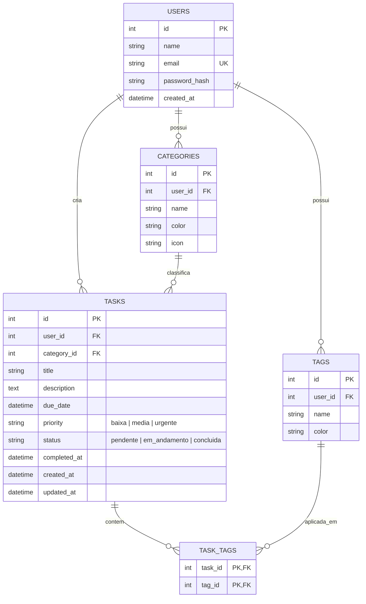

# 🚀 TaskFlow - Gerenciador de Tarefas & Painel de Produtividade

<p align="center">
  
  
  
  
  
  
</p>

Uma aplicação web fullstack completa, elegante e intuitiva desenvolvida para organizar sua rotina pessoal e profissional, acompanhar metas em tempo real e fornecer uma visão clara e analítica da sua produtividade diária e semanal.

---

## 🌟 Funcionalidades

- **🧭 Barra Lateral (Sidebar)**: Menu retrátil fixado à esquerda com acesso rápido a Início, Minhas Tarefas, Categorias, Configurações, alternador de tema e perfil.
- **📊 Painel Inicial (Dashboard)**:
  - Saudação personalizada (*"Bom dia / Boa tarde / Boa noite, [Usuário]"*).
  - Card de destaque com a contagem de tarefas **concluídas na última semana (últimos 7 dias)**.
  - Cards de KPIs em tempo real (Total Ativas, Feitas Hoje, Atrasadas, Vencendo Hoje).
  - Barra de progresso de produtividade geral com taxa percentual.
  - Seção dedicada de **Tarefas Próximas a Vencer** com ação rápida de conclusão.
- **📋 Minhas Tarefas & 🗂️ Quadro Kanban**:
  - Visualização em **Lista** com busca textual instantânea e filtros dinâmicos por status, categoria, prioridade e tag.
  - Visualização em **Quadro Kanban** (*A Fazer, Em Andamento, Concluído*) com botão para **"+ Criar Nova Coluna"** personalizada.
- **➕ Botão Flutuante (FAB)**: Botão flutuante no canto inferior direito para criação ágil de tarefas a partir de qualquer visualização.
- **🔐 Autenticação & Recuperação de Senha**:
  - Login e Cadastro com criptografia `bcrypt` e tokens `JWT`.
  - Fluxo integrado para **Recuperação de Senha** (*"Esqueceu a senha?"*).

---

## ☁️ Como Hospedar na Vercel

O projeto já está configurado para deploy automático na **Vercel** com `vercel.json` e suporte a Serverless Functions em `api/index.js`.

### Passo a Passo para Deploy:

1. Acesse o painel da [Vercel](https://vercel.com/) e clique em **"Add New Project"**.
2. Conecte sua conta do GitHub e importe o repositório **`taskflow-productivity-app`**.
3. Na seção **Environment Variables** (Variáveis de Ambiente), adicione:
   - `JWT_SECRET`: *Gere uma chave segura e aleatória (ex: `e7f2b9a1c4d8e0f3...`)*
   - `NODE_ENV`: `production`
   - `VITE_API_URL`: `/api` *(caso utilize a API integrada na Vercel)*
4. Clique em **"Deploy"**. A Vercel executará o build do frontend e disponibilizará a aplicação no link público gerado!

---

## 🔑 Variáveis de Ambiente

Consulte o arquivo `.env.example` para obter a lista completa de variáveis:

```env
# Backend / Serverless
PORT=3001
NODE_ENV=production
JWT_SECRET=sua-chave-secreta-jwt-super-segura-2026

# Frontend (Vite)
VITE_API_URL=/api
```

---

## 🛠️ Stack Tecnológica

### Frontend
- **React 18** com **Vite** para build ultrarrápido.
- **Design System Vanilla CSS**: Variáveis CSS personalizadas, Modo Escuro (Obsidian & Neon Glass) e Modo Claro, Glassmorphism e microinterações táteis.
- **Lucide Icons**: Conjunto moderno de ícones vetoriais.
- **Canvas-Confetti**: Efeito de celebração visual ao concluir tarefas.
- **Axios**: Cliente HTTP com interceptors automáticos para injeção de tokens JWT.

### Backend
- **Node.js + Express**: API RESTful organizada e modularizada.
- **SQLite3**: Banco de dados relacional com integridade referencial (`PRAGMA foreign_keys = ON`).
- **JWT (JSON Web Token)**: Autenticação stateless e segura.
- **Bcrypt.js**: Criptografia de senhas com salt rounds.

---

## 🗄️ Modelo Relacional do Banco de Dados



---

## 🚀 Como Executar o Projeto Localmente

### Pré-requisitos
- [Node.js](https://nodejs.org/) (versão 18 ou superior)
- [Git](https://git-scm.com/)

### 1. Clonar o Repositório
```bash
git clone https://github.com/guilherme5bottura/taskflow-productivity-app.git
cd taskflow-productivity-app
```

### 2. Iniciar o Backend
```bash
cd server
npm install
npm run dev
```
> O servidor backend iniciará em `http://localhost:3001` e gerará automaticamente o banco de dados `database.sqlite` com as categorias iniciais (*Trabalho, Casa, Estudo, Pessoal*).

### 3. Iniciar o Frontend
Em um novo terminal:
```bash
cd client
npm install
npm run dev
```
> O frontend iniciará em `http://localhost:5173`. Acesse no seu navegador para começar a usar!

---

## 🌐 Endpoints da API

| Método | Rota | Descrição | Autenticação |
|---|---|---|:---:|
| `POST` | `/api/auth/register` | Cadastra um novo usuário | ❌ |
| `POST` | `/api/auth/login` | Realiza login e gera token JWT | ❌ |
| `POST` | `/api/auth/forgot-password` | Valida e-mail para recuperação | ❌ |
| `POST` | `/api/auth/reset-password` | Redefine a senha do usuário | ❌ |
| `GET` | `/api/auth/me` | Retorna dados do usuário autenticado | ✅ |
| `GET` | `/api/stats/dashboard` | Retorna métricas, tarefas da semana e próximas a vencer | ✅ |
| `GET` | `/api/tasks` | Lista tarefas com filtros múltiplos e busca | ✅ |
| `POST` | `/api/tasks` | Cria uma nova tarefa com tags e categorias | ✅ |
| `PUT` | `/api/tasks/:id` | Atualiza uma tarefa existente | ✅ |
| `PATCH` | `/api/tasks/:id/toggle` | Alterna status (Pendente ⇄ Concluída) | ✅ |
| `DELETE` | `/api/tasks/:id` | Remove uma tarefa | ✅ |
| `GET` | `/api/categories` | Lista categorias do usuário | ✅ |
| `POST` | `/api/categories` | Cria uma nova categoria | ✅ |
| `GET` | `/api/tags` | Lista tags do usuário | ✅ |
| `POST` | `/api/tags` | Cria uma nova tag | ✅ |

---

## 📄 Licença
Distribuído sob a licença MIT.
